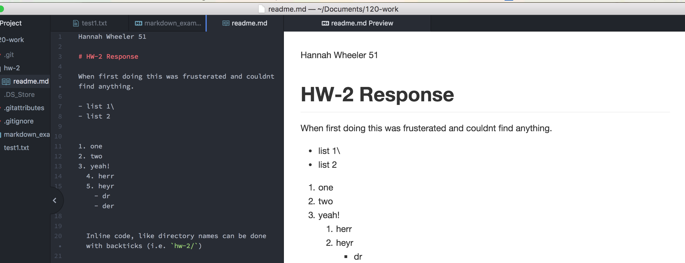

Hannah Wheeler 51

# HW-2 Response

When first doing this was frusterated and couldnt find anything. and that was super frusterating.
I then found a few things and slowly starting pooting peices together. But
I still kept hitting walls and couldn't move forward which just made me more frustrated.
But then I went into see the proffessor and he made sense of a lot of it and So then I was able to move forward. Yay me.

I then learned how to do a list like this

- list 1\
- list 2

And then one like this

1. one
2. two
3. yeah!
  4. herr
  5. heyr
    - dr
    - der

  Inline code, like directory names can be done with backticks (i.e. `hw-2/`)

  If I want something to be **bold** I use two astricks.

And then I learned how to do a screenshot and that was great.

  

  I was shown how to do a lot of things and I am excited to learn more. I am very interested in coding and becoming a better artist.
